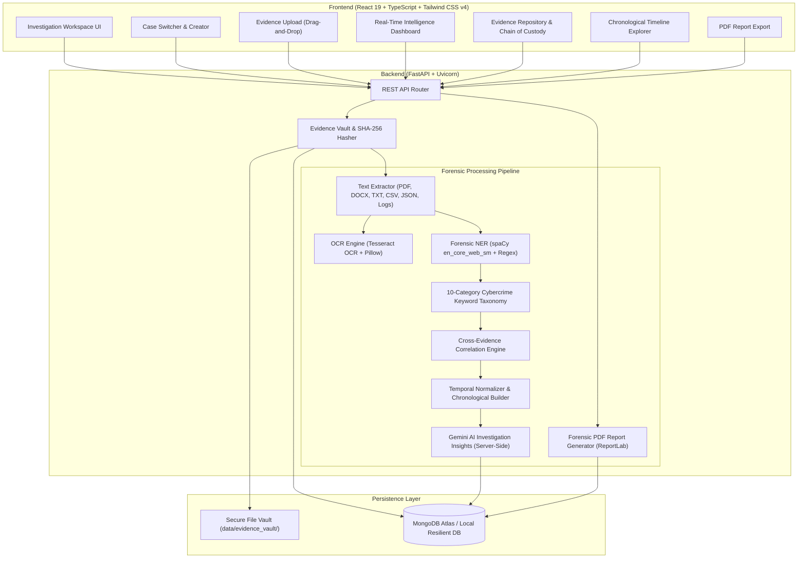

# AI Cyber Investigation Assistant

> **A Defensible Digital Evidence Intelligence & Forensic Analysis Platform**  
> Department of Artificial Intelligence & Data Science | Team B-10

---

## 📌 Executive Summary

Manual analysis of digital evidence is time-consuming, fragmented, and prone to human oversight. The **AI Cyber Investigation Assistant** is an end-to-end digital forensic intelligence system designed to automate evidence ingestion, cryptographic integrity verification, multi-format text extraction/OCR, forensic Named Entity Recognition (NER), cybercrime keyword detection, chronological timeline generation, cross-evidence correlation, and AI-assisted investigation reporting.

The application strictly separates **verified extracted facts** from **AI-assisted hypotheses** and preserves cryptographic chain of custody using SHA-256 hashing.

---

## 🏛️ System Architecture



---

## 🛠️ Technology Stack

| Layer | Technologies |
| :--- | :--- |
| **Frontend** | React 19, Vite 8, TypeScript, Tailwind CSS v4, Lucide React, Axios |
| **Backend** | Python 3.12, FastAPI, Uvicorn, Pydantic v2 |
| **Database** | MongoDB Atlas (Motor async driver) with resilient local storage fallback |
| **Document Processing** | `pypdf`, `pdfplumber`, `python-docx`, native CSV/JSON/Text parsers |
| **OCR** | Tesseract OCR (`pytesseract`, `Pillow` image pre-processing) |
| **NLP & Regex** | spaCy (`en_core_web_sm`), custom regex forensic pattern extractors |
| **AI / LLM** | Google Gemini API (`gemini-2.5-flash` server-side only) |
| **Reporting** | ReportLab (Defensible PDF generation with cryptographic hashes & signatures) |

---

## 🔄 Investigation Workflow

1. **Case Creation**: Assign unique case identifier (`CASE-2026-XXXXX`), title, and lead investigator.
2. **Evidence Upload**: Drag-and-drop or select files (PDF, DOCX, TXT, CSV, JSON, PNG, JPG, chat exports).
3. **File Validation & Hashing**: Immediate cryptographic **SHA-256** calculation to maintain digital chain of custody.
4. **Immutable Evidence Vault**: Raw files stored read-only in `data/evidence_vault/{case_id}/`.
5. **Text Extraction & OCR**: Multi-format extraction with image preprocessing and Tesseract OCR fallback.
6. **Forensic Entity Recognition**: Extracts Persons, Organizations, Dates, Phone Numbers, Emails, IP Addresses, URLs, and Crypto wallets.
7. **Suspicious Keyword Taxonomy**: Detects matches across 10 cybercrime categories (Unauthorized access, Credential theft, Malware, Phishing, Data exfiltration, Financial fraud, Suspicious transfer, Deletion/log wiping, Confidential info, Extortion).
8. **Cross-Evidence Correlation**: Uncovers common suspects, shared contact records, matching IP addresses, and overlapping files.
9. **Timeline Generation**: Normalizes timestamps into an interactive chronological sequence without inventing dates.
10. **Gemini AI Investigation Insights**: Server-side grounded evidence synthesis, pattern detection, and investigative leads.
11. **Persistent Storage**: All case intelligence stored persistently in MongoDB.
12. **Forensic PDF Report**: One-click generation and download of formal case dossier via ReportLab.

---

## 🚀 Quickstart & Setup Guide

### Prerequisites
* **Python 3.12+** (managed via `uv` or system Python)
* **Node.js 18+** & npm
* *(Optional)* **Tesseract OCR** for image text recognition ([Download Windows Installer](https://github.com/UB-Mannheim/tesseract/wiki))
* *(Optional)* **MongoDB Atlas** connection string & **Gemini API key**

---

### Step 1: Clone Repository & Setup Backend

```bash
cd "d:/AI Cyber Investigation Assistant/backend"

# Create Python 3.12 virtual environment
uv venv .venv --python 3.12
# Or using standard python: python -m venv .venv

# Activate virtual environment
# Windows:
.\.venv\Scripts\activate
# Linux/macOS:
source .venv/bin/activate

# Install dependencies
pip install -r requirements.txt

# Download spaCy language model
python -m spacy download en_core_web_sm
```

### Step 2: Configure Environment Variables

Copy the template in `backend/.env.example` to `backend/.env`:

```ini
# MongoDB Atlas Connection String (Optional - defaults to local resilient storage if empty)
MONGODB_URI=mongodb://localhost:27017
MONGODB_DB_NAME=cyber_investigation

# Google Gemini API Key (Optional - server-side assistive insights)
GEMINI_API_KEY=your_gemini_api_key_here

# Tesseract OCR Executable Path
TESSERACT_CMD=C:\Program Files\Tesseract-OCR\tesseract.exe

# Evidence Storage Directory
EVIDENCE_VAULT_DIR=./data/evidence_vault

# Allowed CORS Origins
CORS_ORIGINS=http://localhost:5173,http://localhost:3000,http://127.0.0.1:5173
```

### Step 3: Run the Backend Server

```bash
# From backend directory with venv activated:
uvicorn app.main:app --host 127.0.0.1 --port 8000 --reload
```

Backend API will be live at: `http://127.0.0.1:8000`  
Interactive Swagger Docs at: `http://127.0.0.1:8000/docs`

---

### Step 4: Setup & Run the Frontend

Open a new terminal window at the project root:

```bash
cd "d:/AI Cyber Investigation Assistant"

# Install frontend dependencies
npm install

# Start Vite development server
npm run dev
```

Frontend application will be live at: `http://127.0.0.1:5173`

---

## 📡 REST API Reference

| Method | Endpoint | Description |
| :--- | :--- | :--- |
| `GET` | `/api/health` | Backend status, DB connectivity, and AI configuration |
| `POST` | `/api/cases` | Create a new cyber investigation case |
| `GET` | `/api/cases` | List all stored cases with evidence metrics |
| `GET` | `/api/cases/{case_id}` | Retrieve case metadata |
| `DELETE` | `/api/cases/{case_id}` | Delete case and associated evidence files |
| `POST` | `/api/cases/{case_id}/evidence` | Multipart evidence file upload with SHA-256 calculation |
| `GET` | `/api/cases/{case_id}/evidence` | List all ingested evidence files with hashes |
| `DELETE` | `/api/cases/{case_id}/evidence/{id}` | Delete an individual evidence file from vault |
| `POST` | `/api/cases/{case_id}/analyze` | Execute extraction, OCR, NLP, keywords, correlation, and AI pipeline |
| `GET` | `/api/cases/{case_id}/dashboard` | Retrieve full aggregated case intelligence |
| `GET` | `/api/cases/{case_id}/report/pdf` | Stream formal forensic PDF investigation report |

---

## 🧪 Testing & Verification

An automated end-to-end verification suite is included in `backend/tests/`:

```bash
# Run complete multi-stage pipeline test:
backend\.venv\Scripts\python.exe backend\tests\test_e2e_pipeline.py
```

This test automatically verifies:
1. Database connectivity
2. Case creation
3. Evidence ingestion & SHA-256 calculation
4. Text extraction (TXT, PDF, PNG)
5. spaCy Named Entity Recognition
6. Forensic regex extraction (Emails, Phones, IPs)
7. Suspicious keyword taxonomy detection
8. Chronological timeline generation
9. Cross-evidence correlation
10. ReportLab PDF generation and stream validity

---

## 🐳 Docker Deployment

To run the complete backend with MongoDB using Docker Compose:

```bash
docker-compose up --build -d
```

---

## 📄 License & Attribution

Developed for **Dr. Mahalingam College of Engineering & Technology**, Department of Artificial Intelligence & Data Science.
Team Number: **B-10**.
Supervised by **Ms. M. Rajalakshmi, AP(SS) / AI&DS**.
